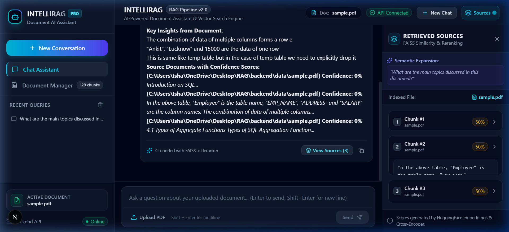
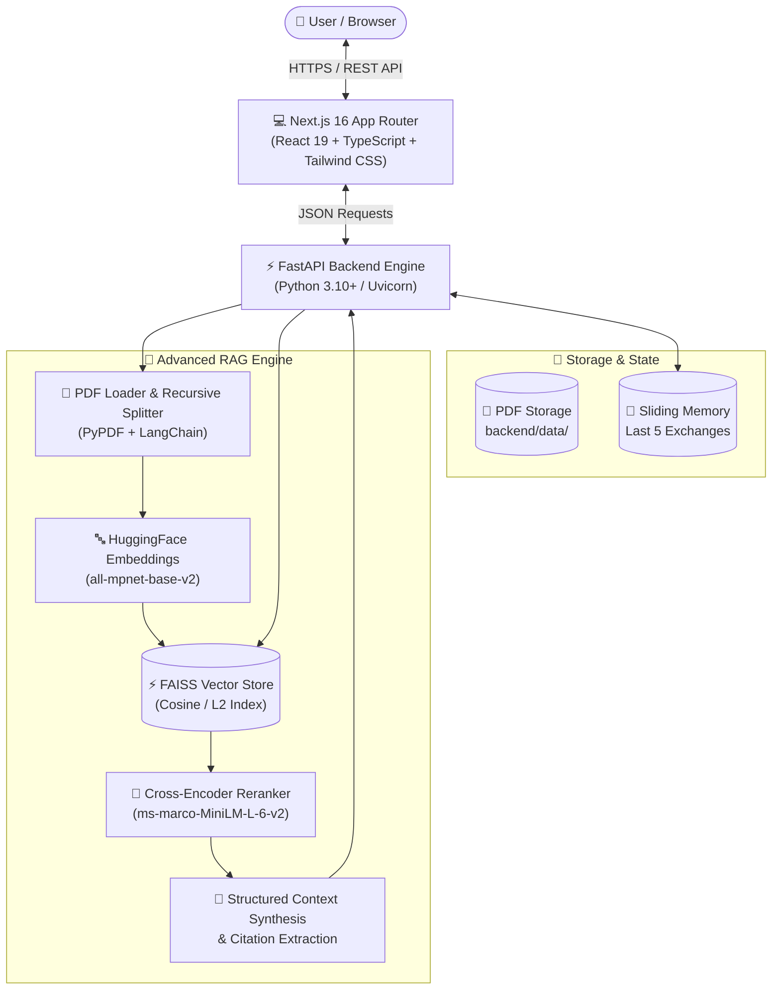
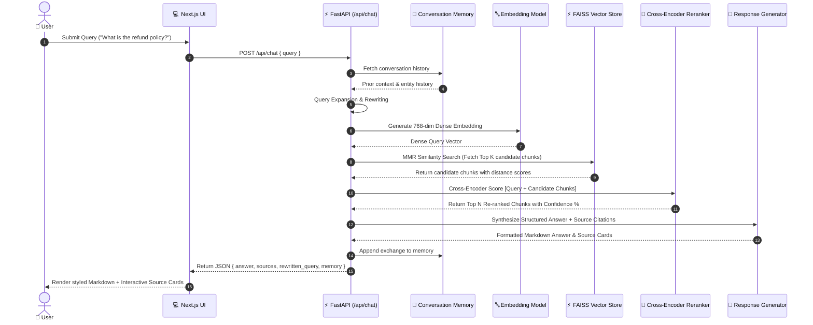
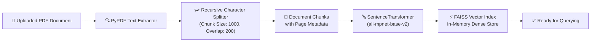

# IntelliRAG — Enterprise AI-Powered Document Assistant

> **Full-Stack Retrieval-Augmented Generation (RAG) Platform** with semantic dense embeddings, Cross-Encoder reranking, conversation memory, and a modern Next.js SaaS interface.

---

## 📸 Visual Showcase

<div align="center">
  
  <p><em>IntelliRAG Modern Web Interface — Featuring live AI chat responses, conversation history, real-time backend status, and transparent Source Attribution with confidence metrics.</em></p>
</div>

---

## 🌟 Overview

**IntelliRAG** transforms static PDF documents into an interactive conversational intelligence platform. By combining dense vector embeddings with multi-stage Cross-Encoder reranking and structured answer generation, IntelliRAG allows users to query complex documents and receive accurate, cited answers with document-level confidence metrics and source verification.

---

## 📊 Architecture & Pipeline Flowcharts

### 1. High-Level System Architecture



---

### 2. Detailed RAG Query Execution Pipeline



---

### 3. PDF Ingestion & Indexing Pipeline



---

## ✨ Features

- **📄 Document Upload & Processing**: Instant PDF parsing using `PyPDF` and chunking via `RecursiveCharacterTextSplitter`.
- **⚡ Vector Database**: High-speed similarity search powered by `FAISS`.
- **🧠 Advanced RAG Pipeline**:
  - **Query Expansion & Rewriting**: Optimizes short or ambiguous queries before vector lookup.
  - **Maximal Marginal Relevance (MMR)**: Balances similarity with document diversity.
  - **Cross-Encoder Reranking**: Re-scores candidate chunks using `cross-encoder/ms-marco-MiniLM-L-6-v2`.
- **💬 Conversation Memory**: Retains multi-turn dialogue context across exchanges.
- **🎨 Modern Next.js UI**:
  - Built with Next.js 16 (App Router), React 19, TypeScript, and Tailwind CSS.
  - Interactive ChatGPT-style conversation view with markdown rendering.
  - Live **Sources Panel** displaying confidence scores, chunk previews, and source filenames.
  - Responsive left sidebar with query history, system status indicators, and active document switching.
- **🐳 Production Ready**: Complete Docker Compose setup, Nginx reverse proxy configuration, and 1-click VPS deployment script.

---

## 🛠️ Technology Stack

| Layer | Technologies |
| :--- | :--- |
| **Frontend** | Next.js 16 (App Router), React 19, TypeScript, Tailwind CSS, Lucide Icons, React Markdown |
| **Backend API** | Python 3.10+, FastAPI, Uvicorn, Pydantic |
| **RAG & ML** | LangChain, HuggingFace Transformers, Sentence-Transformers (`all-mpnet-base-v2`, `ms-marco-MiniLM-L-6-v2`) |
| **Vector Store** | FAISS (Facebook AI Similarity Search) |
| **Deployment** | Docker, Docker Compose, Nginx, Render (`render.yaml`), VPS (`deploy.sh`) |

---

## 📁 Project Structure

```
RAG/
├── backend/
│   ├── app/
│   │   ├── __init__.py
│   │   ├── main.py              # FastAPI server launcher
│   │   ├── api.py               # REST API endpoints (/api/chat, /api/upload, etc.)
│   │   ├── config.py            # Global configuration settings
│   │   │
│   │   └── rag/
│   │       ├── __init__.py
│   │       ├── chatbot.py       # Advanced RAG pipeline, reranker, memory
│   │       ├── loader.py        # PDF loader module wrapper
│   │       ├── pdf_loader.py    # PyPDF loader & Recursive Character Splitter
│   │       └── vector_store.py  # FAISS vector store & MMR retrieval
│   │
│   ├── data/                    # Sample PDF documents
│   ├── tests/                   # Pytest & unit tests suite
│   ├── requirements.txt         # Python dependencies
│   └── .env.example             # Backend environment template
│
├── frontend/
│   ├── app/                     # Next.js App Router (page.tsx, layout.tsx)
│   ├── components/
│   │   ├── chat/                # ChatContainer, ChatMessage, ChatComposer, EmptyState
│   │   ├── documents/           # DocumentPanel, UploadModal
│   │   ├── layout/              # Sidebar, Header, SourcesPanel
│   │   └── ui/                  # Badge, LoadingSpinner
│   │
│   ├── lib/
│   │   ├── api.ts               # Centralized REST API client
│   │   └── types.ts             # TypeScript interfaces
│   │
│   ├── Dockerfile               # Multi-stage Next.js standalone container
│   ├── package.json
│   └── tsconfig.json
│
├── docs/
│   └── assets/
│       └── screenshot_ui.png    # High-resolution UI preview
│
├── nginx/
│   └── rag-chatbot.conf         # Production Nginx reverse proxy configuration
│
├── Dockerfile                   # Backend Docker container definition
├── docker-compose.yml           # Unified multi-service Docker Compose file
├── deploy.sh                    # 1-Click VPS deployment & SSL setup script
├── render.yaml                  # Render cloud deployment blueprint
├── requirements.txt             # Root Python requirements bridge
├── start_demo.bat               # Windows 1-click local launch script
└── README.md                    # Project documentation
```

---

## ⚡ Quick Start & Local Execution

### Option 1: One-Click Start (Windows)
Double-click `start_demo.bat` or run in terminal:
```cmd
start_demo.bat
```
This automatically starts both the FastAPI backend (`http://127.0.0.1:8000`) and the Next.js frontend (`http://localhost:3000`), then opens your browser.

---

### Option 2: Manual Terminal Setup

#### **1. Backend Setup**
```bash
# Navigate to backend directory
cd backend

# Install Python dependencies
pip install -r requirements.txt

# Run FastAPI backend server
python -m uvicorn app.api:app --host 127.0.0.1 --port 8000 --reload
```
API Documentation (Swagger UI) available at `http://127.0.0.1:8000/docs`.

#### **2. Frontend Setup**
```bash
# Navigate to frontend directory
cd frontend

# Install Node dependencies
npm install

# Run Next.js development server
npm run dev
```
Open `http://localhost:3000` in your browser.

---

### Option 3: Docker Compose
```bash
# Build and launch all containers
docker compose up --build -d

# View running containers
docker compose ps
```

---

## 🌐 Production VPS Deployment

Deploying to Oracle Cloud, AWS, DigitalOcean, or Hetzner VPS:

```bash
# 1. SSH into VPS
ssh user@your-vps-ip

# 2. Clone repository
git clone https://github.com/Isha2307/RAG--CHATBOT.git /opt/rag-chatbot
cd /opt/rag-chatbot

# 3. Edit deploy script to set your domain/subdomain
nano deploy.sh   # Set DOMAIN="rag.yourdomain.com"

# 4. Execute 1-click deployment script (Builds Docker, configures Nginx & sets up Let's Encrypt SSL)
bash deploy.sh
```

---

## 🔌 API Endpoints Reference

| Method | Endpoint | Description |
| :--- | :--- | :--- |
| `GET` | `/api/health` | System status, active PDF document, chunk count, and memory state |
| `GET` | `/api/documents` | Lists all available indexed PDF files and active flags |
| `POST` | `/api/select_document` | Switches active document and re-indexes FAISS vector store |
| `POST` | `/api/upload` | Uploads a new PDF document, chunks text, and indexes in FAISS |
| `POST` | `/api/chat` | Executes the complete RAG query pipeline (returns answer + sources) |
| `POST` | `/api/clear` | Clears conversation memory exchanges |

---

## 🧪 Testing & Validation

```bash
# Run backend test suite
python -m unittest discover backend/tests

# Verify frontend build
cd frontend && npm run build
```

---

## 📄 License

MIT License. Designed and engineered for software development engineer portfolio demonstration.